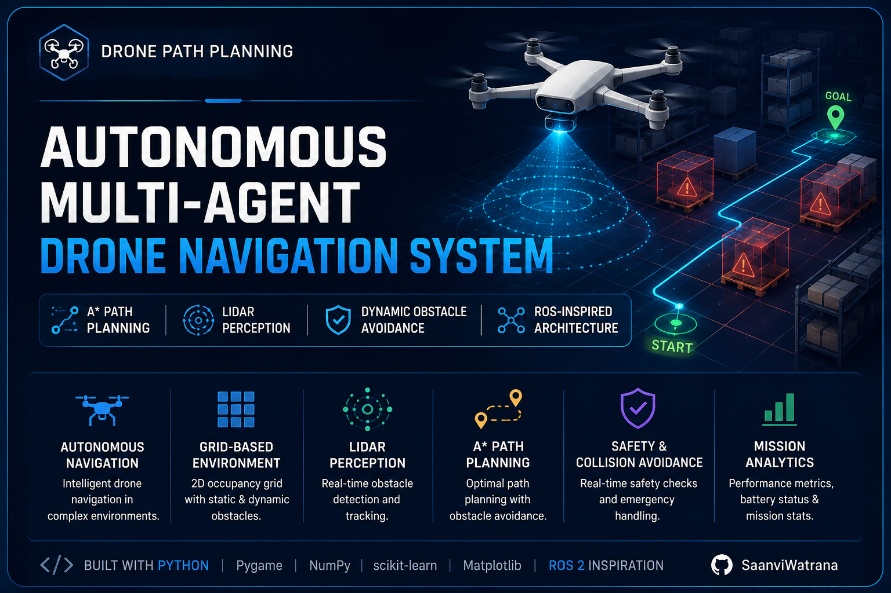

# Autonomous Multi-Agent Drone Navigation System

A modular Python-based simulation of autonomous drone navigation in dynamic environments, combining **A* global path planning, obstacle perception, safety monitoring, path smoothing, motion control, and multi-agent task allocation**.

The project is designed as a **ROS-inspired robotics architecture** where navigation responsibilities are separated into independent modules that communicate through a lightweight message bus.

---

## 🚁 Overview

The system simulates autonomous drones navigating a 2D environment containing static and dynamic obstacles.

The navigation pipeline combines global planning with perception and safety mechanisms so that drones can:

* Generate collision-free paths using **A*** search
* Detect and process obstacles using simulated **LiDAR**
* Build obstacle-aware costmaps
* Smooth generated paths for more realistic motion
* Monitor collision risk through a dedicated safety layer
* Predict the movement of dynamic obstacles
* Replan when the environment changes
* Coordinate multiple navigation components through a ROS-style message bus
* Allocate tasks across multiple drones

---

## 🏗️ System Architecture

The system follows a modular robotics architecture inspired by ROS/ROS2 design principles.

```text
                    ┌──────────────────────┐
                    │     Mission / Goal   │
                    └──────────┬───────────┘
                               │
                               ▼
                    ┌──────────────────────┐
                    │   Task Allocator     │
                    └──────────┬───────────┘
                               │
                               ▼
                    ┌──────────────────────┐
                    │    Planner Node      │
                    │        A*            │
                    └──────────┬───────────┘
                               │
                               ▼
                    ┌──────────────────────┐
                    │    Path Smoother     │
                    └──────────┬───────────┘
                               │
                               ▼
                    ┌──────────────────────┐
                    │   Controller Node    │
                    └──────────┬───────────┘
                               │
                               ▼
                    ┌──────────────────────┐
                    │        Drone         │
                    └──────────────────────┘

       ┌─────────────────────────────────────────────┐
       │             Perception Pipeline              │
       │                                             │
       │  LiDAR → Perception → Obstacle Prediction   │
       │                         ↓                    │
       │                      Costmap                 │
       └──────────────────────┬──────────────────────┘
                              │
                              ▼
                       ┌──────────────┐
                       │ Safety Node  │
                       └──────────────┘

              ┌──────────────────────────┐
              │      Message Bus         │
              │  ROS-style communication │
              └──────────────────────────┘
```

---

## 🧩 Core Components

### Planner Node

Responsible for global route generation using the **A*** search algorithm.

**Responsibilities:**

* Grid-based path planning
* Start/goal handling
* Obstacle-aware navigation
* Path generation for the controller

### Controller Node

Converts the planned path into drone motion commands.

**Responsibilities:**

* Path following
* Motion control
* Lookahead-based navigation
* Goal-distance monitoring
* Obstacle-aware control behavior

### LiDAR Simulation

Provides simulated range measurements between the drone and surrounding obstacles.

The perception pipeline can process these measurements to represent detected obstacles in the navigation environment.

### Perception

Processes sensor information and maintains obstacle information used by downstream navigation components.

### Costmap

Represents obstacle information in a grid-based navigation structure.

The costmap allows the planner and safety mechanisms to account for obstacle proximity rather than treating the environment as purely binary free/occupied space.

### Obstacle Predictor

Provides a mechanism for reasoning about dynamic obstacle movement, supporting navigation in environments containing moving obstacles.

### Safety Node

Provides an independent safety layer for monitoring potential collision situations.

This separates safety-related decisions from the primary planning and control logic.

### Task Allocator

Handles task assignment for multiple drones, providing the foundation for multi-agent mission coordination.

### Message Bus

A lightweight ROS-style communication layer that allows different modules to exchange information without tightly coupling their implementations.

---

## ⚙️ Navigation Pipeline

The primary navigation flow is:

```text
Goal
 ↓
Task Allocation
 ↓
A* Global Planner
 ↓
Path Smoothing
 ↓
Controller
 ↓
Drone Motion
```

In parallel, the perception and safety pipeline continuously provides environmental information:

```text
LiDAR
 ↓
Perception
 ↓
Obstacle Information
 ├──→ Costmap
 ├──→ Obstacle Prediction
 └──→ Safety Node
          ↓
       Replanning / Control Response
```

This separation mirrors the design philosophy used in larger robotics navigation systems, where **planning, perception, control, and safety are independently maintained subsystems**.

---

## ✨ Key Features

* **A* Global Path Planning**
* **Dynamic Obstacle Handling**
* **Simulated LiDAR Perception**
* **Obstacle Prediction**
* **Grid-Based Costmap**
* **Path Smoothing**
* **Dedicated Safety Layer**
* **Multi-Agent Task Allocation**
* **ROS-Inspired Modular Architecture**
* **Message-Based Module Communication**
* **Real-Time Pygame Visualization**
* **Python-Based Robotics Simulation**

---

## 🛠️ Technology Stack

| Technology                | Purpose                                    |
| ------------------------- | ------------------------------------------ |
| Python                    | Core implementation                        |
| Pygame                    | Real-time simulation and visualization     |
| NumPy                     | Numerical computation                      |
| Matplotlib                | Visualization and analysis                 |
| Scikit-learn              | Data processing / clustering functionality |
| A*                        | Global path planning                       |
| LiDAR Simulation          | Environment perception                     |
| Costmaps                  | Obstacle-aware navigation                  |
| ROS-inspired architecture | Modular robotics design                    |

---

## 📁 Project Structure

```text
drone-path-planning/
│
├── main.py
│
├── astar.py
├── controller.py
├── controller_node.py
├── costmap.py
├── drone.py
├── goal.py
├── lidar.py
├── message_bus.py
├── obstacle.py
├── obstacle_predictor.py
├── path_smoother.py
├── perception.py
├── perception_node.py
├── planner_node.py
├── robot_core.py
├── safety_node.py
├── slam.py
└── task_allocator.py
│
├── README.md
├── requirements.txt
└── .gitignore
```

---

## 🚀 Installation

### 1. Clone the repository

```bash
git clone https://github.com/SaanviWatrana/drone-path-planning.git
cd drone-path-planning
```

### 2. Install dependencies

```bash
pip install -r requirements.txt
```

### 3. Run the simulator

```bash
python main.py
```

A Pygame simulation window will launch and display the navigation environment.

---

## 🖥️ Simulation
🖥️ Simulation Demo

The simulator provides a real-time visual environment for testing autonomous drone navigation, path planning, obstacle perception, and safety behavior.

🎥 Full Demo

▶️ Watch the Full Drone Navigation Demo

The demonstration shows the navigation system operating in a dynamic simulated environment with autonomous agents, obstacles, planned paths, and real-time safety behavior.

Simulation Environment

The simulator includes:

Autonomous drone navigation
Grid-based environment
Static and dynamic obstacles
Planned navigation paths
Real-time obstacle handling
Safety state monitoring
Multi-agent navigation behavior

Note: The demo video is included directly in the repository under assets/.

## 🧠 Engineering Concepts Demonstrated

This project applies concepts from several areas of robotics and autonomous systems:

### Path Planning

* A* graph search
* Grid-based navigation
* Heuristic-based route selection

### Perception

* LiDAR simulation
* Obstacle representation
* Sensor-to-navigation data flow

### Motion Planning

* Path smoothing
* Dynamic obstacle consideration
* Cost-based navigation

### Robotics Architecture

* Modular nodes
* Message-based communication
* Separation of planning, control, perception, and safety

### Multi-Agent Systems

* Task allocation
* Multiple drone coordination concepts

---

## 🔬 Design Philosophy

The project is structured around a **separation-of-concerns architecture**.

Instead of implementing navigation as one large program, major responsibilities are separated into modules:

```text
Perception
    ↓
Planning
    ↓
Control
    ↓
Execution

Safety
    ↓
Monitors navigation independently

Task Allocation
    ↓
Coordinates missions across agents
```

This makes the system easier to:

* Test
* Debug
* Extend
* Replace individual algorithms
* Adapt toward a real robotics middleware architecture

---

## 🔮 Future Improvements

Potential extensions include:

* Full ROS2 node implementation
* Nav2 integration
* Multi-drone collision avoidance
* Real-time trajectory optimization
* Improved dynamic obstacle prediction
* SLAM-based map generation
* Hardware sensor integration
* Real drone/robot deployment
* Mission-level performance analytics
* Web-based monitoring dashboard

---

## 📌 Project Status

**Status:** Active robotics simulation project

The current implementation focuses on developing and validating the core navigation architecture in a simulated environment before moving toward hardware or ROS2-based deployment.

---

## 👩‍💻 Author

**Saanvi Watrana**

B.Tech Computer Science — Data Science

GitHub: [SaanviWatrana](https://github.com/SaanviWatrana)

---

## 📄 License

This project is available under the MIT License.
